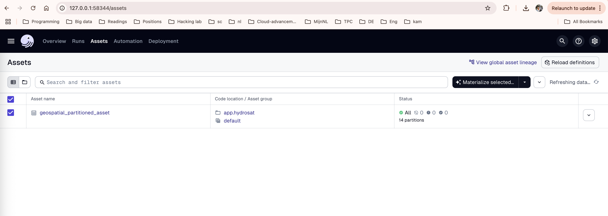
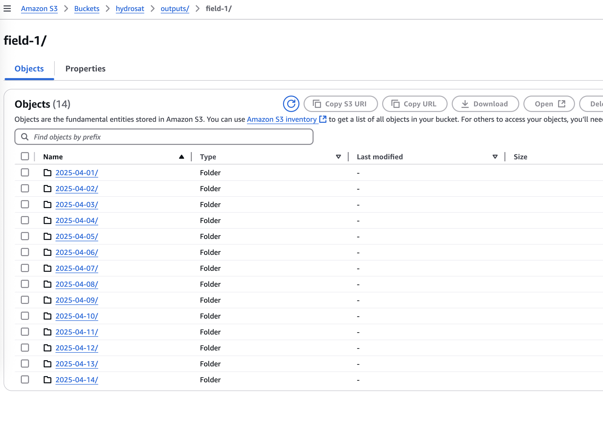
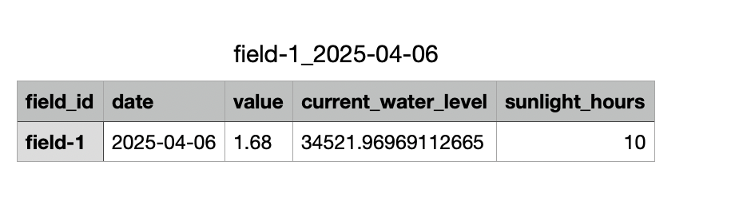
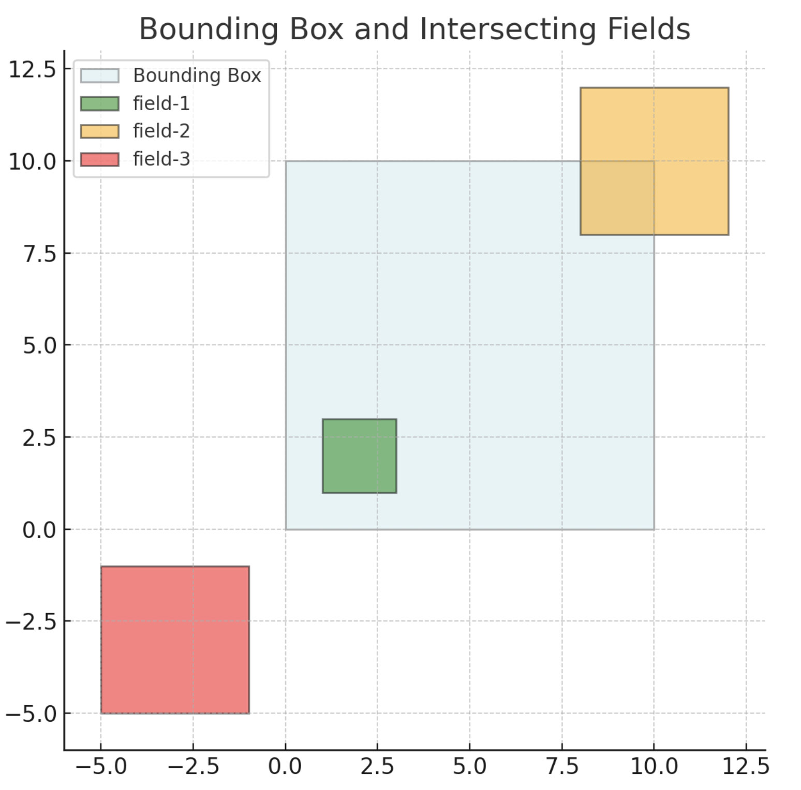

# 🌍 Hydrosat Geospatial Processing Pipeline

## 🚀 How to Run This Project

This project sets up a **geospatial data processing pipeline using Dagster**, running on **Kubernetes (Minikube)** and deployed via **Terraform and Helm**. The pipeline ingests polygonal field boundaries and bounding boxes from S3, simulates daily crop/environmental data, and stores the outputs back in S3 as a materialized asset partitioned by field name and date.

---

### 🧰 Prerequisites

Ensure you have the following tools installed:

| Tool        | Version           | Notes |
|-------------|-------------------|-------|
| Python      | 3.11+             | Required to run Dagster pipeline code |
| Docker      | Latest            | Used to build the Dagster image |
| Minikube    | Latest            | For running Kubernetes locally |
| kubectl     | Latest            | CLI for managing Kubernetes |
| Terraform   | ≥ 1.0.6           | For infrastructure provisioning |
| Helm        | ≥ 2.0.0           | For deploying Helm charts like Dagster |

---

### 🏁 Getting Started

#### 1. **Clone the Repository**

```bash
git clone https://github.com/your-org/hydrosat.git
cd hydrosat
```

#### 2. **Start Minikube**

Start a local Kubernetes cluster:

```bash
minikube start
```

Since we're using Minikube, ensure that your `kubectl` context is set correctly:

```bash
kubectl config use-context minikube
kubectl config get-contexts
```

Optionally, launch the Minikube dashboard:

```bash
minikube dashboard
```

#### 3. **Deploy Infrastructure with Terraform**

Initialize and apply the Terraform configuration:

```bash
cd terraform
terraform init
terraform plan
terraform apply
```

This process:

- Builds and pushes a Docker image to your specified Docker Hub repository.
- Creates Kubernetes secrets (e.g., AWS credentials).
- Deploys Dagster via Helm with environment-specific values.
- Sets up required infrastructure and configures deployments.

> Credentials are managed via two files:
> - `.env` – Environment variables for local use.
> - `terraform.tfvars` – Terraform-specific variables (with base64-encoded secrets).

AWS (for S3 access) and Docker Hub credentials are required. These are provided, but you can replace them with your own by updating:

- `aws_access_key_id` and `aws_secret_access_key` in `terraform.tfvars` (base64-encoded).
- The same keys in `.env` (in plain text).

#### 4. **Access Dagster UI**

After `terraform apply` completes (typically 2–5 minutes), expose the Dagster UI locally:

```bash
export DAGSTER_WEBSERVER_POD_NAME=$(kubectl get pods --namespace default -l "app.kubernetes.io/name=dagster,app.kubernetes.io/instance=dagster,component=dagster-webserver" -o jsonpath="{.items[0].metadata.name}")
kubectl --namespace default port-forward $DAGSTER_WEBSERVER_POD_NAME 8080:80 >> server_logs.txt &
```

Then open [http://127.0.0.1:8080](http://127.0.0.1:8080) in your browser.

#### 5. **Materialize Assets**

This pipeline defines a single main asset: `geospatial_partitioned_asset`.

Each day’s run depends on the output of the previous day. The asset consumes its own prior output to simulate temporal crop/environmental metrics.

#### 6. **Running the Pipeline**

Once deployed:

1. Open the Dagster UI.
2. Locate `geospatial_partitioned_asset`.
3. Trigger a materialization for a specific partition (date) or all available partitions.
4. Monitor logs and check outputs in your configured S3 bucket.



#### 7. **Input Files**

Located in the `inputs/` directory:

- `bbox.json`: Contains the bounding box geometry.
- `fields.json`: Contains a list of fields with polygon geometries.

You can upload these files to your preferred S3 bucket if needed.

#### 8. **Output**

The output includes simulated data files for each field that intersects with the bounding box. For the given inputs, two of the three fields intersect and are processed. The third is ignored.

Outputs are organized in S3 under:

```
s3://hydrosat/output/field-1/
s3://hydrosat/output/field-2/
```

Each day’s data is saved in a subfolder partitioned by date, starting from `2025-04-01`.

Sample:



Folder structure:



---

## 🌾 Project Overview

### 🧠 What It Does

This pipeline simulates a **daily water and sunlight model** for agricultural fields using geospatial input data.

Each execution:
- Reads bounding box (`bbox.json`) and field data (`fields.json`) from S3.
- Validates if previous day’s output exists.
- If found, uses it to simulate the current day's environmental data.
- Saves results back to S3, partitioned by date and field.

Pipeline input overview:



---

## 🧬 Architecture

The app follows [12-factor app](https://12factor.net/) principles with clear separation between application logic, infrastructure, configuration, and data.

- **Dagster**: Schedules and orchestrates partitioned runs.
- **S3**: Stores input and output geospatial data.
- **Docker**: Packages the Dagster app.
- **Kubernetes**: Hosts the pipeline on Minikube.
- **Terraform**: Provisions infrastructure and secrets.
- **Helm**: Configures Dagster deployments.

### 📁 Project Structure

```
hydrosat/
├── app/                      # Dagster pipeline and Dockerfile
│   └── hydrosat/             # Core pipeline code
│       └── assets.py         # Partitioned asset logic
│   ├── requirements.txt
│   └── Dockerfile
│
├── terraform/
│   ├── helm/                 # Helm values config
│   │   └── values.yaml
│   ├── modules/              # Reusable Terraform modules
│   ├── main.tf
│   └── README.md
```

- The `app/` directory contains Dagster code and Docker context.
- The `terraform/` directory contains infrastructure definitions and deployment logic.

---

## 🔧 Configuration

### 📦 Docker Image

Terraform builds and deploys the Docker image from the `app/` folder:

```hcl
resource "docker_image" "hydrosat" {
  name = "najeebrgn/hydrosat_najeeb:latest"
  build {
    context    = "${path.module}/../../../app"
    dockerfile = "Dockerfile"
  }
}
```

Ensure your Docker Hub credentials are valid (provided in `.env` and `terraform.tfvars`).

### 🔐 Secrets and Environment Variables

AWS and S3 settings are passed through Kubernetes secrets and Helm values.

##### Kubernetes Secret

```hcl
resource "kubernetes_secret" "aws_secrets" {
  metadata {
    name      = var.secret_name
    namespace = var.namespace
  }
  data = {
    for key, value in var.data : key => base64decode(value)
  }
  type = "Opaque"
}
```

##### Helm Environment Variables

```hcl
set {
  name  = "dagsterUserDeployments.s3Bucket"
  value = var.s3_bucket
}
```

In Dagster Python code, you can access them as:

```python
EnvVar("S3_BUCKET")
EnvVar("AWS_REGION")
```

---

## 🛠️ Local Development

To test locally:

```bash
pip install -r app/hydrosat/requirements.txt
dagster dev
```

Use `dagster dev` to open a local development UI.

---

## 🔍 Monitoring & Debugging

- Use the **Dagster UI** to inspect runs, logs, and assets.
- Open the **Minikube dashboard** with:

  ```bash
  minikube dashboard
  ```

- Review logs and output in the S3 bucket.

---

## 📬 Feedback

Found a bug or want to contribute? Feel free to open an issue or pull request on GitHub.

---

## 🛠️ TODOs

Planned improvements for v2:

- Add unit tests for Dagster assets and jobs.
- Refactor code into separate modules for assets, jobs, schedules.
- Treat the previous day's output as a separate asset dependency.
- Centralize configuration in one place for easier overrides.
- Add support for both local and cloud deployment contexts.
- Add Docker Compose setup for local Docker testing.
- Improve secure handling of credentials.

---